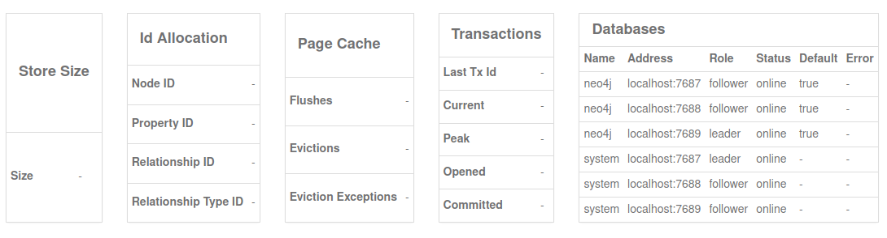
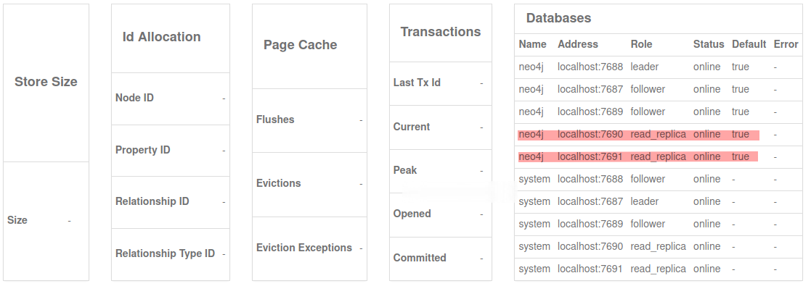

# Neo4j Cluster 

## Oprettelse af et Cluster med tre servere og to replicas 

***

### Oprettelse af 3 cluster

[Link for cluster tutorial](https://neo4j.com/docs/operations-manual/current/tutorial/local-causal-cluster/#tutorial-local-cluster)

***

Cluster config og replica configuration kan findes in 
* neo4j_cluster/config folder

***

Start hver Cluster med følgende kommando :

```
bin/neo4j start
```

For at se status eller stoppe serveren :

```
bin/neo4j status
bin/neo4j stop
```

For at se logfilerne :

```
Linux and MacOS:
tail -n100 logs/neo4j.log
Windows: 
Get-Content .\logs\neo4j.log -Tail 10 -Wait
```

Kontroller clusters status ved at køre følgende i Neo4j Browser :

```
:sysinfo
```



***

Klik på nedenstående links for at åbne serverne i browser vinduet

- [Link for cluster 1](http://localhost:7474/browser/)
- [Link for cluster 2](http://localhost:7475/browser/)
- [Link for cluster 3](http://localhost:7476/browser/)

Brug følgende loginoplysninger for replikaer og cluster:

**database:** efterlad tom 

**username:** neo4j

**password:** 1234

***
### Create 2 replicas



Kontroller clusters status ved at køre følgende i Neo4j Browser :

```
:sysinfo
```

- [Link for replica 1](http://localhost:7477/browser/)
- [Link for replica 2](http://localhost:7478/browser/)
