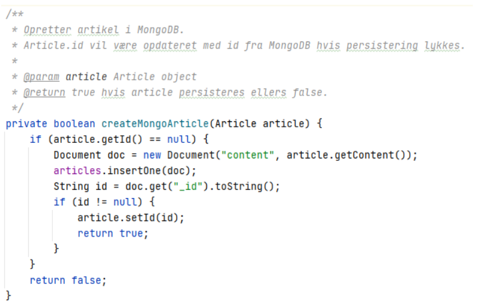

[Home](README.md)
# MongoDB documentation

I modsætning til den relationelle database, må vi forventeligt have en hurtig og skalerbar database til håndtering af artikler, idet disse kan komme fra mange kilder, samtidigt og være af variabel størrelse. 
Da vi således ikke kan være sikre på, hvilke data vi skal lagre ifm. artikler, skønnes det at være bedre, med en form for ‘document store’, hvor artikler kan lagres i sin rå form. Heraf kan læses, at vi benytter os af ELT; extract-load-transform, således at vi blot kan scrape og gemme data, for senere at behandle det.

