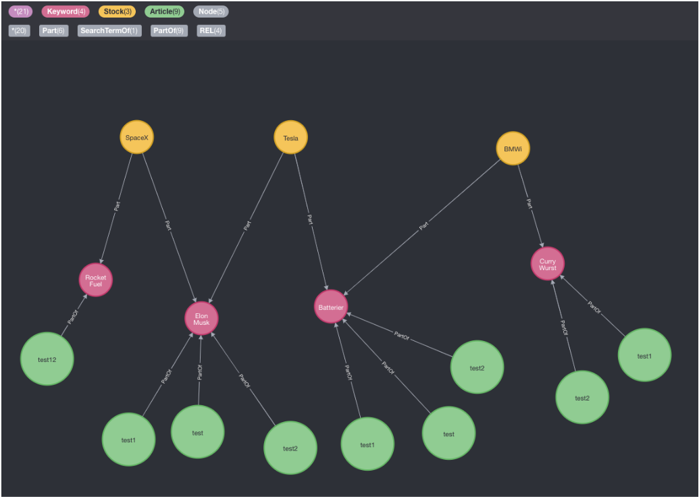
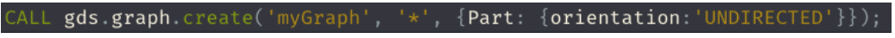
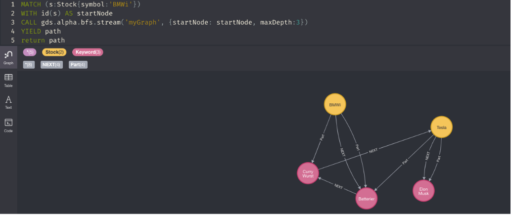
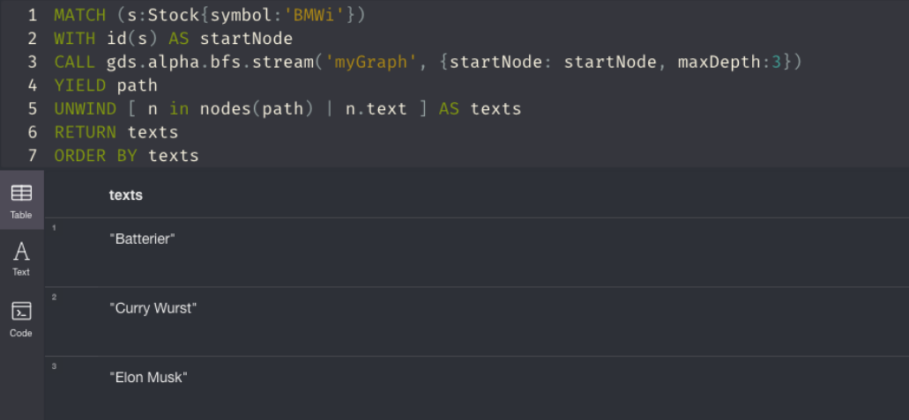

[Home](README.md)
# Neo4j documentation

I forbindelse med at en bruger tilføjer søgeord til en aktie, skal systemet komme med relevante forslag til yderligere søgeord, baseret på andre brugeres tilføjelser til samme aktie. Til denne funktionalitet har vi valgt neo4j, da en graph database er skabt til at kunne traversere sine noder meget hurtigere end eksempelvis at foretage et opslag på 3 tabeller i den relationelle database.
Så selvom vi ville kunne frembringe de nødvendige data ved at foretage sql-forespørgslen herunder, vil vi kunne frembringe de samme data med en cypher forespørgsel hurtigere.

I løbet af udviklingen har vi testet traversering af data vha. gds-plugin  i neo4j med flg. udgangspunkt. De orange noder er aktier, de pink noder er søgeord tilknyttet aktier. De grønne noder vil være artikeldata, dette gør vi ikke brug af for gennemløb af søgeord.

For at kunne gennemløbe ovenstående struktur med udgangspunkt i en aktie, gennem et søgeord, hvortil relationen er ‘directed’, må vi lave en graph, der baseres på både Stock- og Keyword noder og som er ‘undirected’.

Med denne graph er vi nu istand til at gennemløbe noderne fra et givent udgangspunkt, f.eks. aktien ‘BMWi’ gennem relationer af typen ‘Part’ til alle andre typer noder. Billedet herunder, viser den resulterende graf, når vi traverserer med en dybde på 3. 

Vi kan, på samme måde, trække tekster fra noder med property’en ‘text’ og således opnå en liste af relevante søgeordsforslag, se herunder:

Neo4J giver også mulighed for horisontal skalering i clusters, så vi ville kunne dirigere trafik mod lokale servere hvis det skulle vise sig nødvendigt vha. konfiguration af server policies. Her kunne man også forestille sig et setup, hvor eksempelvis danske aktier følges via skandinaviske servere.