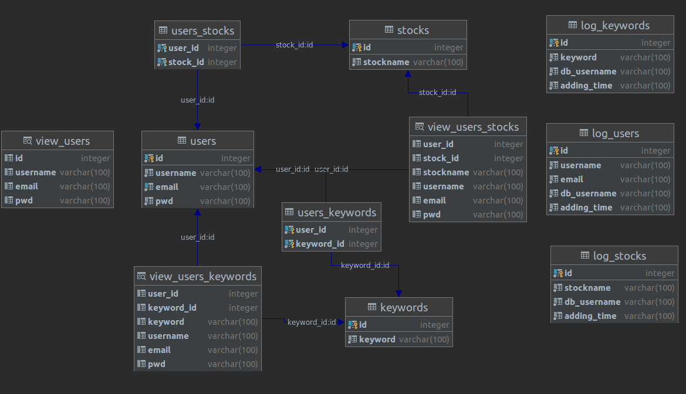
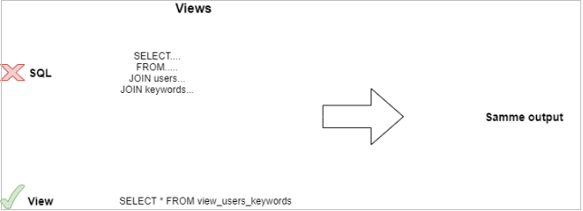
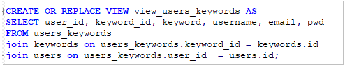
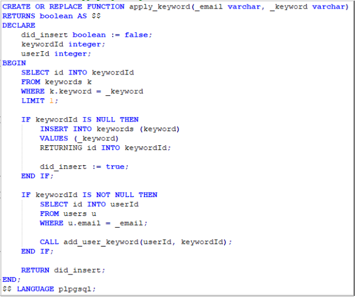
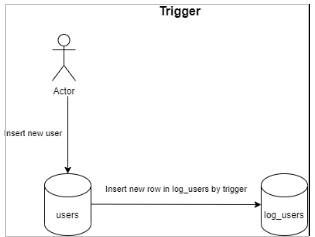
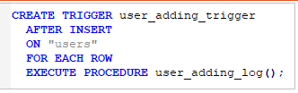
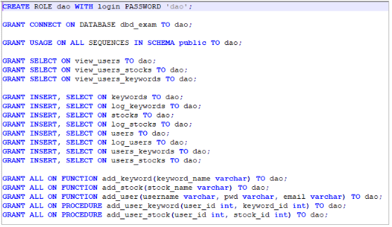

[Home](README.md)
# Postgres dokumentation

### Database strukture

***

### Generelt

Vi har valgt at bruge en relationel database til at gemme brugere, aktier og søgeord. Dette skyldes at vi på forhånd kender strukturen på data, og dermed tabellerne. Derudover ville vi gerne udnytte den relationelle databases funktioner med bl.a. Views, Stored procedures and functions og Triggers.

***

### Views

På vores relationelle database, har vi valgt at oprette views til nogle af de queries, som kunne være en meget kompleks SQLsyntax. Et view kan være med til at gøre et kompliceret SQL-syntax væsentlig nemmere, fordi det ligger indbygget i et SELECT-statement – se nedenstående illustration.

Nedenfor viser vi ovenstående **view_users_keywords** SQL syntax, hvor man tydeligt kan se, at det er nemmere at kalde et view i stedet for den rå SQL syntax.

***

### Stored procedures and functions

I relationelle databaser har man mulighed for at bruge funktioner til at udføre ændringer i databasen. Dette hedder **Stored procedures and functions**. Disse gør det muligt at udføre en form for kode inden i selve en **function** i stedet for en masse SQL-queries. 

Nendenfor vi ser vi et eksempel på en **function** i vores relationelle database, som generelt finder en bruger, og derefter tjekker om dens søgeord findes i forvejen, således at hvis det gør kobles brugerens id med det eksisterende søgeords id – ellers oprettes søgeordet på ny og den nye id bruges til at koble forbindelse mellem brugeren og søgeordet.

Ovenstående kode gør følgende:

1. Tager **email** og **keyword**
2. Angiver at function skal returnere **boolean**
3. Deklærer **lokale variabler** kun til brug i denne **function**
4. Finder **id** på det pågældende søgeord
5. Hvis **id** er **NULL/ikke findes** så oprettes det i databasen og sætter det nye id i variablen **keywordId**
6. Herefter findes **brugerens id** ud fra den angivne email.
7. Der kaldes en **stored procedure (add_user_keyword)** hvor efter brugerens id og keywordId indsættes.

***

### Triggers

I vores relationelle database har vi implementeret triggers på vores tabeller til brugere, aktier og søgeord. Dette er implementeret på den måde, at hver gang der indsættes en ny række i en af de nævnte tabeller, så indsættes samtidig en række i en log tabel. 

Hvis man kigger på nedenstående illustration, som viser en trigger på vores **users-tabel**, så er det kun delen mellem **Actor** og **users-tabellen**, som man udfører, hvorefter den sidste del mellem users-tabellen og **log_users-tabellen** sker automatisk, da der er opsat en **trigger** på **users-tabellen**.

Nedenfor viser vi koden for en **trigger** på **users-tabellen**.

* CREATE TRIGGER = Her laver vi en **trigger**
* AFTER INSERT = Reagere efter et **INSERT-statement**
* ON = Hvilken tabel som triggeren sættes på – her på tabellen **users**
* FOR EACH ROW = Udføres efter hver række ændres.
* EXECUTE PROCEDURE = Funktion som skal udføres, når triggeren aktiveres.

Nedenfor vises koden for funktionen **user_adding_log()** som aktiveres i ovenstående trigger.

Her kan ses, at denne funktion som aktiveres, indsætter i tabellen **log_users** på de angivne kolonner. Under values kan ses at der er nævnt **NEW**, dette gør, at det refererer til den nyeste række kolonner. Hvis man havde en UPDATE-statement, kunne man også bruge OLD, her ville OLD være lig med den værdi man havde i databasen før man lave update-querien. Dermed kunne man sige at OLD er den tidligere/gamle værdi og NEW er den nye/seneste værdi.
Derudover indsætter vi to system commands i tabellen i form af **current_user**, som angiver den aktive postgres user, som gemmer dataen og **current_date**, som angiver den nuværende dato til logging.

***

### Roles

I vores relationelle database har vi valgt, at oprette en role, således at vi ikke bruger **postgres** brugeren eller en lignende admin bruger, som har rettigheder til alt. Vi har oprettet en bruger som har rettigheder til at **INSERT og SELECT** på de tabeller, hvor det er nødvendigt, således sættes rettighedsniveauet til det mindst mulige. Nedenstående illustration viser hvilke rettigheder som vores role har.

Herunder vises vores SQL kode til oprettelse og tildeling af rettigheder til vores role. Ovenstående illustration viser rettighederne på vores tabeller **users, stocks, keywords**.
Derudover er tildelt rettigheder til bl.a. **sequences, log-tabeller og functions**.

