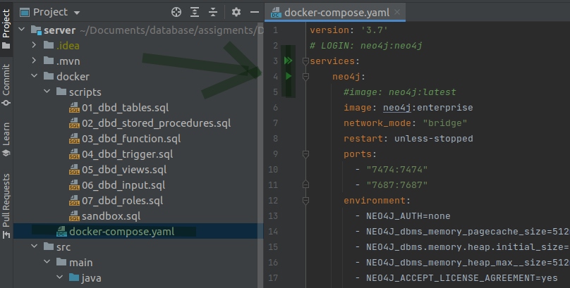
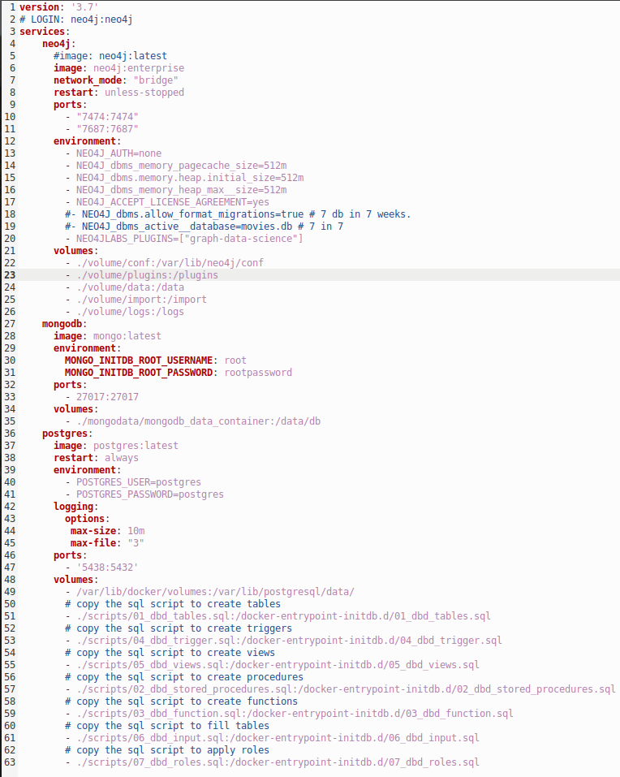

# Database projekt:

**Dato: 02-juni-2021**


**Studerende:**

* Claus Kramath, cph-ck83@cphbusiness.dk
* Morten Feldt, cph-mf227@cphbusiness.dk
* Mads Wulff, cph-mn492@cphbusiness.dk
* Jörg Oertel, cph-jo130@cphbusiness.dk

*** 

## Installations instruktioner

### Kør Postgres, MangoDB og Neo4j med hjælp af Docker

For alle tre databaser, valgte vi at oprette en docker-compose-fil for nem implementering.
Vores docker-compose-fil kan køres enten i en bash-terminal eller i Intellij. 

1.  **Ind i Intellij:**



2. **Ind i bash terminalen:**


```
docker-compose up [-d]
```

For at stoppe containern, indtast:

```
docker-compose down
```

***

### Postgres

* port: 5438
* role
    * default role:
        * password: postgres
        * username: postgres
    * restricted role:
        * password: dao
        * username: dao

Inde i docker-compose-filen under volumes, fortæller vi docker at kopiere forskellige SQL-scripts ind i docker-containeren. Docker kører scripts i alfabetisk rækkefølge, og derfor har vi kontrol over, hvilket script der først skal udføres, og hvilket sidste. 

***

### MongoDB

* port: 27017
* role
    * password: root
    * username: rootpassword

***

### Neo4j
 
* port: 7474
* role:
    * password: no password needed (efterlad blank)
    * username: no username needed (efterlad blank)
* Neo4j er tilgængelig på:
    * http://localhost:7474/browser/

***

### Compose fil



***

## Postman endpoints

All endpoints are available on Postman by clicking on the link below.

[](https://app.getpostman.com/run-collection/9752892a1bb7a06b7994)

Detailed information about the endpoints are available on the link below. 

[Endpoint documentation](https://documenter.getpostman.com/view/6773992/TzXzEHQb)

***

## Dokumentation

1. [**Java Server dokumentation**](SERVER.md)
2. [**Postgres dokumentation**](POSTGRES.md)
3. [**MongoDB dokumentation**](MONGODB.md)
4. [**Neo4j dokumentation**](NEO4J.md)
5. [**Rapport**](/documents/dbd_rapport.pdf)
6. [**Cluster(ikke implementere)**](CLUSTER.md)

***


