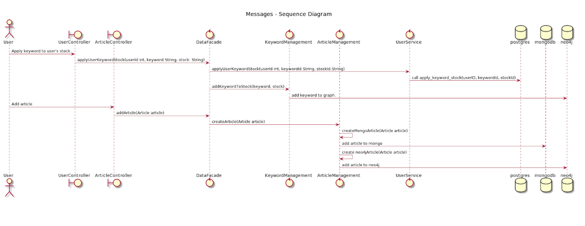

[Home](README.md)
# Server documentation

## Server teknologi:

Serveren, som tilbyder REST endpoints, håndterer de videre funktionskald mod databaserne ved hjælp af en datafacade, services og DTO i tråd med lagdelt arkitektur. Herunder ses en forsimplet udgave, hvor 2 use cases, apply keyword og add article, er beskrevet.

***